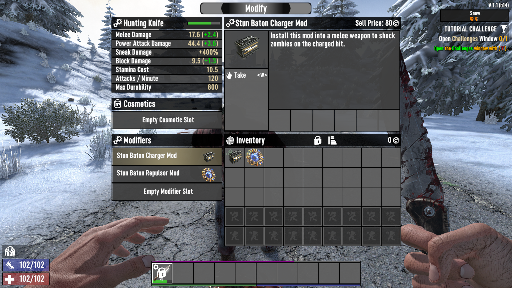
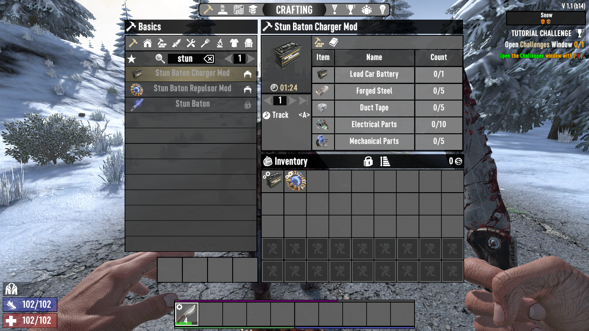

# ISI Mods Unbound

A 7 Days to Die (7D2D) mod that adds a Charger mod, which replicates the shock effect of the stun baton. This mod allows both the Charger and Repulsor mods to be installed on any melee weapon. The Charger mod must be equipped for the Repulsor mod's ragdoll effect to activate.

## TODO

- If possible, move the shock and repulsion effects into the mods themselves, so it does not have to be copied to every melee weapon.

## My Other Mods

If you like this mod, you might like my other mods:

<https://next.nexusmods.com/profile/IronSharkInc/mods?gameId=1059>
