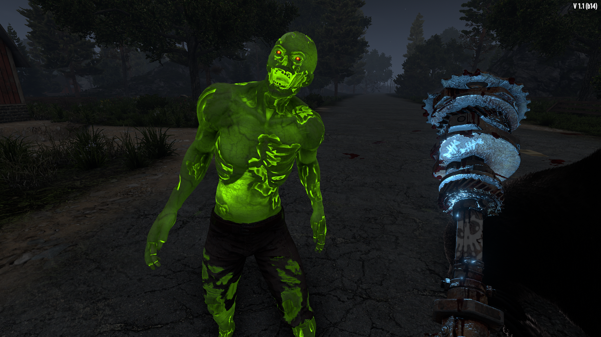

# ISI Shockwave

A 7 Days to Die (7D2D) mod that adds a Charger mod, which replicates the shock effect of the stun baton. This mod allows both the Charger and Repulsor mods to be installed on any melee weapon. The Charger mod must be equipped for the Repulsor mod's ragdoll effect to activate.

<!-- TODO v2 notes -->

## 1.1.1.0

- now works properly on sledge turrets
- more obvious when weapon is charged (stun baton's charged sound + more visible sparks)
- effects moved to mods
- customizable options in item_modifiers.xml
  - tech_junkie_six_grants_chance_to_charge_instantly (after reading tech junkie 6 attacks have a chance to instantly charge the weapon)
  - electrocutioner_extends_duration (stun/ragdoll for longer based on electrocutioner level)
  - make_duration_extension_melee_only (melee weapons stun for longer than ranged)
  - allow_charger_to_be_installed_in_ranged_weapons (can add shock effect to ranged attacks)
  - allow_repulsor_to_be_installed_in_ranged_weapons (can add ragdoll effect to ranged attacks)
    - _disabled by default, shock + ragdoll from range seemed too powerful to me_

## TODO

- Add Charger schematic (instead of tech junkie #5?)
- Better Nerd Tats
  - Vanilla: adds shock aoe, extends ragdoll duration to match shock duration
  - Move ragdoll AOE to buff too?
  - Require buff to match AOE duration to single target duration?
  - Increase AOE range?
  - More force?
  - Increase buff time?

## My Other Mods

If you like this mod, you might like my other mods:

<https://next.nexusmods.com/profile/IronSharkInc/mods?gameId=1059>
